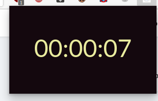

# losted_time

A chrome / edge extension to calculate how much time you have passed in a website

as we know that we can have people who use facebook more than 1 hour a day.
so this extension will give you the opportunity to handle the time you pass in each website.

for now it's shows you only the time you passed in each website in HH:MM:SS format.
 

 

 

 

current feautures : 

* calculate the time passed in each website : 

next feautures : 

* adding the possibility to denay access to a website if you passed a specified time

* graph that represent the time of week you have passed in a website.

# how to use : 

the extension is simple to install : 

-> just open the extensions tab in edge or chrome browsers : 

-> drag and drop the losted_time.crx 

-> enjoy !

thank you!
## created by Kestar